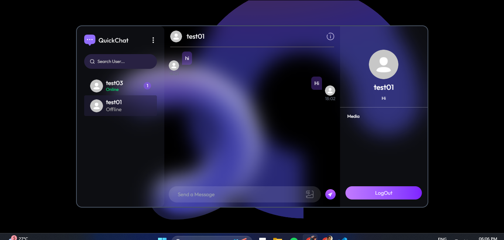
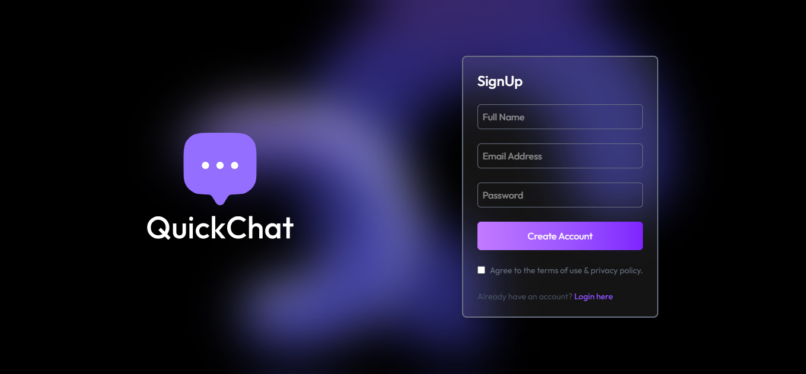

# 💬 Chat App

A real-time chat application built as part of the **CODING SAMURAI Internship Task**.  
This project demonstrates the implementation of live messaging features, authentication, and a clean UI for smooth user interaction.

🔗 **GitHub Repository:** [Chat App](https://github.com/karanpr01/CODING-SAMURAI-INTERNSHIP-TASK/tree/main/Task-2-RealTime-Chat-App)

---

## 🚀 Features

- 🔐 **User Authentication** (Login & Signup)  
- 💬 **Real-Time Messaging** with instant delivery  
- 👤 **User Presence** (Online/Offline status)  
- 📱 **Responsive Design** for all devices  
- ⚡ **Scalable Architecture** ready for deployment  

---

## 🛠️ Tech Stack

- **Frontend:** React.js, Tailwind CSS  
- **Backend:** Node.js, Express.js  
- **Database:** MongoDB  
- **Real-Time Engine:** Socket.IO  

---

## 📂 Project Structure

```bash
Chat-App/
│── client/          # Frontend React application
│── server/          # Backend Express server
│── package.json     # Project dependencies
│── README.md        # Documentation
```

---

## 📸 Screenshots

> *(Add screenshots of the app here)*

  
  

---

## ⚙️ Installation

### 1️⃣ Clone the repository

```bash
git clone https://github.com/karanpr01/CODING-SAMURAI-INTERNSHIP-TASK.git
cd CODING-SAMURAI-INTERNSHIP-TASK/Task-2-RealTime-Chat-App
```

### 2️⃣ Install dependencies

```bash
# Install server dependencies
cd server
npm install

# Install client dependencies
cd ../client
npm install
```

### 3️⃣ Setup environment variables

Create a `.env` file in the **server** directory and add:

```env
MONGO_URI=your_mongodb_connection_string
JWT_SECRET=your_secret_key
PORT=5000
```

### 4️⃣ Run the application

```bash
# Start backend server
cd server
npm start

# Start frontend app
cd ../client
npm start
```

The app will run on:  
- Frontend: `http://localhost:3000`  
- Backend: `http://localhost:5000`  

---

## 📦 Deployment

You can deploy the app using platforms like:  
- **Frontend:** Netlify / Vercel  
- **Backend:** Render / Railway / Heroku  
- **Database:** MongoDB Atlas  

---

## 🧪 Future Enhancements

- ✅ Group Chats  
- ✅ File Sharing (Images, Videos, Documents)  
- ✅ Message Reactions & Emojis  
- ✅ Push Notifications  

---

## 🤝 Contributing

Contributions are welcome! 🎉  
Fork the repository and create a pull request with your improvements.

---

## 📜 License

This project is licensed under the **MIT License**.

---

## 👨‍💻 Author

**Prem Karn**  
🔗 [GitHub Profile](https://github.com/karanpr01)

**Live Link**  
🔗 [Live Link](https://chat-app-eta-ochre.vercel.app/login)

---
